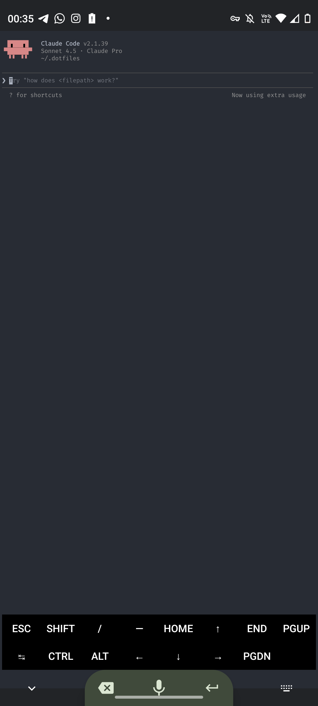

# vibeboard

A voice based keyboard that types what you say

- All processing happens locally
- The keyboard only uses space that would be covered by the navbar anyway
- Only the essential: backspace, record and enter
- Swipes in record button
  - Up: goes to the next keyboard
  - Down: hides the keyboard
  - Left and Right: move cursor

  

