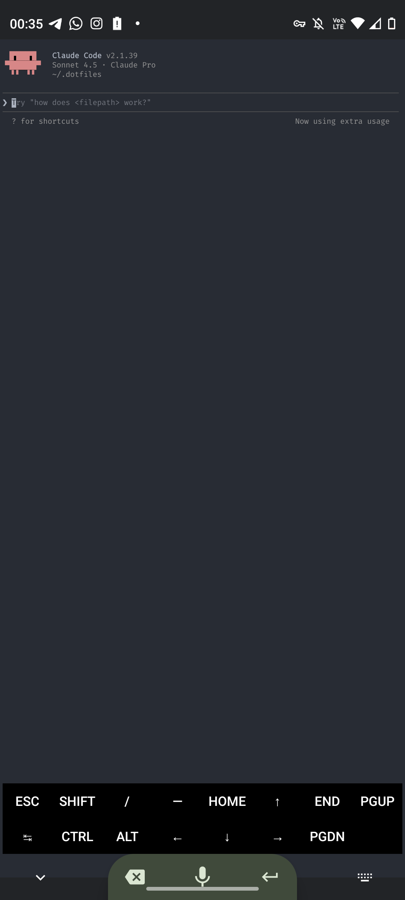

# vibeboard

A voice based keyboard that types what you say

- All processing happens locally
- The keyboard only uses space that would be covered by the navbar anyway
- Only the essential: backspace, record and enter
- Swipes on the record button
  - Up: switches to the previous input method (IME picker if none)
  - Down: hides the keyboard
  - Left and Right: move the cursor

